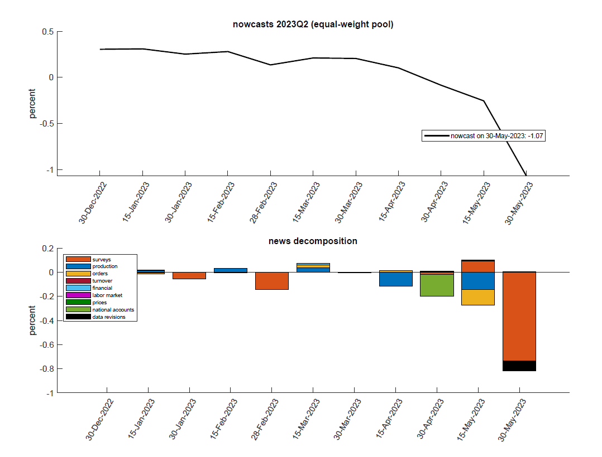
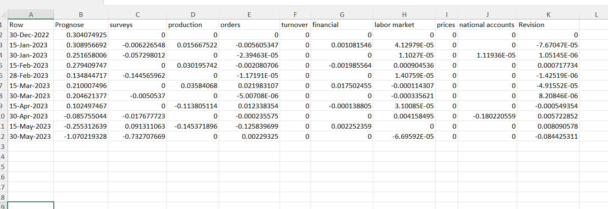
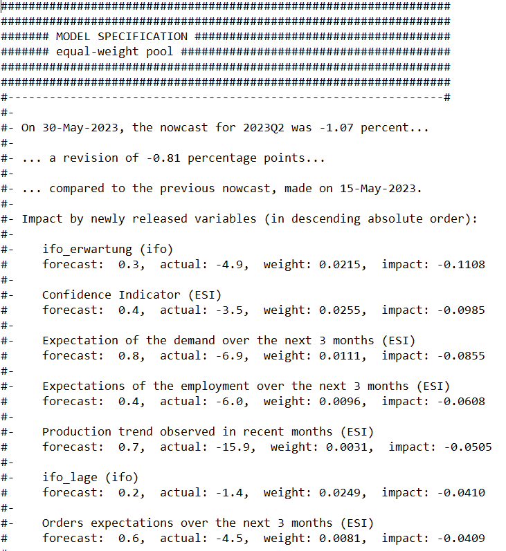
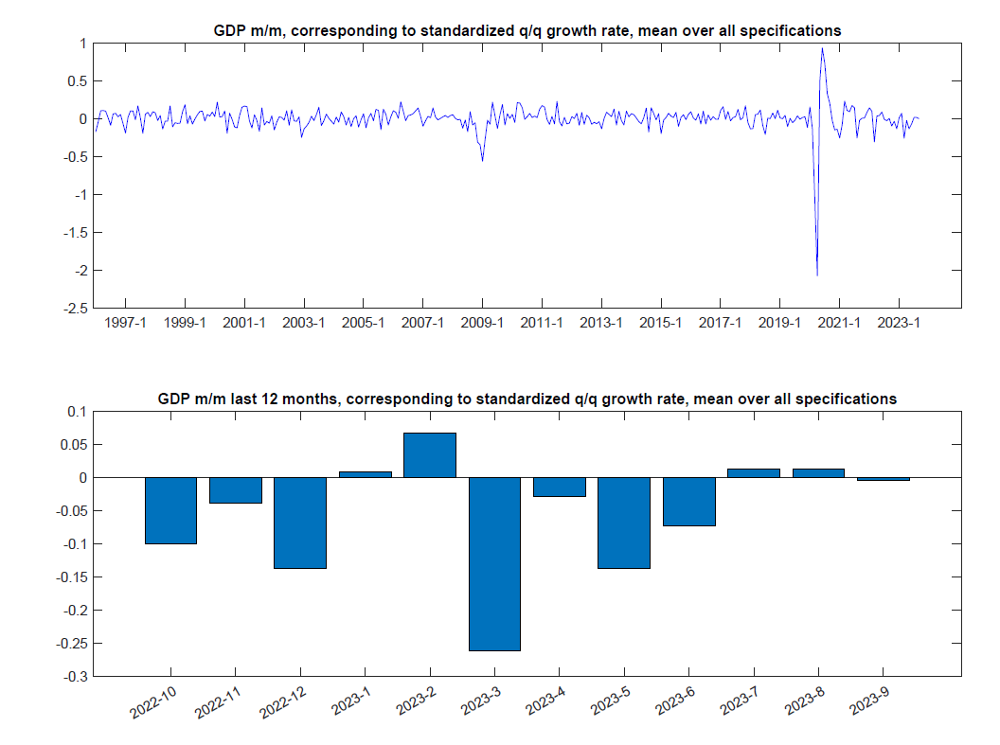
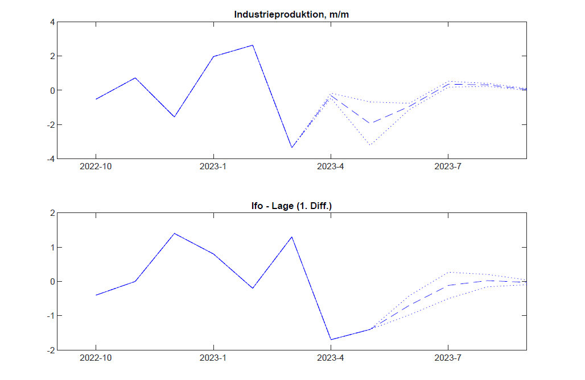

# nowcast-bip-ger

## Overview

This repo estimates mixed-frequency factor models to produce now- and forecasts[^1] of the growth in German gross domestic product (GDP). This class of models is commonly used in the literature (see [here](https://www.newyorkfed.org/research/staff_reports/sr830), [here](https://ideas.repec.org/a/eee/moneco/v55y2008i4p665-676.html), and [here](https://www.sciencedirect.com/science/article/abs/pii/S0169207008000393) for example). The main methodological difference is that I estimate several different specifications of factor models and combine their nowcasts by equally weighting the models' nowcasts (partly motivated by the results in [this paper](https://www.bundesbank.de/resource/blob/703462/5e9829f75a56c8087e83051012fb4d5d/mL/2009-02-17-dkp-03-data.pdf)).

The models are estimated with real-time vintages that are compiled in this repo. These vintages exactly replicate the information set available to forecasters at a specific point in time and include a large cross-section of publicly available macroeconomic data covering the real economy (industrial production, turnover, orders), prices, financial and labor markets as well survey-based sentiment indicators. 

Besides the now- and forecast the scripts also decompose revisions in the now- and forecast over time as new data are released following the approach in [Banbura and Modugno (2010)](https://www.ecb.europa.eu/pub/pdf/scpwps/ecbwp1189.pdf).

Once everything has been set up (see below for details), the scripts performing all the above steps can be run by executing the following batch script `run-nowcast.bat`.

### Sample output

Nowcast evolution (top) and news decomposition (bottom)

## Set-up

### Folder structure

The real-time vintages and nowcasts are **not** stored in the repo but locally! To run the scripts without further modifications, this repo assumes the following structure of how files are stored locally: [copy and paste from here in to your root directory of choice](https://www.dropbox.com/sh/7g186cz8m336pcc/AAC7rUDsL1sePIOjI5eBwblIa?dl=0)!

The folder `Echtzeitdatensatz` in this repo contains the raw data which is largely downloaed automatically as well as the real-time vintages that are needed to estimate the models and compute the nowcasts. The output is stored in the directory `Nowcasts`.

### Data

Most of the time series can be downloaded automatically. However, for a few series a couple of manual steps are necessary. These are described in the following sections. 

#### ifo-index

1. download latest release from the [ifo's website](https://www.ifo.de/umfrage/ifo-geschaeftsklima-deutschland). The file currently has the name format `gsk-d-YYYYMM.xlsx` where YYYY and MM are the year and month of the release

2. rename the file to `ifo_current.xlsx`and place in `Echtzeitdatensatz\raw data\ifo` 

3. update the release dates of the index in the file `release_dates_ifo.csv`

#### Lkw-Maut-Index

All vintages that have been released since the last time the model was run have to be downloaded

1. go to the [press portal of Destatis](https://www.destatis.de/DE/Presse/_inhalt.html) and select **Industrie und Verarbeitendes Gewerbe** and **Güterverkehr** as filters or type **Lkw Mautindex** into the search bar to get the press releases

2. to get the data corresponding to the release, open it and in the interactive figure click on the burger icon and select **CSV-Datei herunterladen**. The file currently has the name `lkw_maut_index_monatlich.csv`

3. rename the file as `lkw_index_YYYY-MM-DD.csv` where YYYY, MM and DD are the year, month and day of the release

4. move the file to `Echtzeitdatensatz\raw data\lkw_maut_index\releases` 

#### Gastgewerbeumsatz

Downloading the vintages for the turnover in the hospitality sector is very similar to those for the Lkw-Maut-Index

1. go to the [press portal of Destatis](https://www.destatis.de/DE/Presse/_inhalt.html) and type **Gastgewerbeumsatz** into the search bar to get the releases

2. to get the data corresponding to the release, open it and in the interactive figure click on the burger icon and select **CSV-Datei herunterladen**. The file currently has the name `umsatz-gastgewerbe.csv`

3. rename the file as `umsatz-gastgewerbe-YYYY-MM-DD.csv` where YYYY, MM and DD are the year, month and day of the release

4. move the file to `Echtzeitdatensatz\raw data\umsatz_gastgewerbe\releases` 

5. update the file `release_dates.csv` by entering the date of the release and the latest data point in the format e.g. 2023M3 for March 2023 

#### ESI surveys

The download of the ESI surveys is automated. However, the release dates need to be updated manually!

1. go to the list of [ESI press releases](https://economy-finance.ec.europa.eu/economic-forecast-and-surveys/business-and-consumer-surveys/download-business-and-consumer-survey-data/press-releases_en)

2. update the file `*\Echtzeitdatensatz\raw data\ESI BCI\releasedates_ESIBCI_csv.csv` by entering the date of the release and the latest data point in the format e.g. 2023M4 for April 2023 

### Configure the batch script

### Choose vintages

Specify the dates for which nowcasts are produced. Typically this will be the end of the second to last quarter of the one being nowcast, i.e. 30 March 2022 when nowcasting 2022Q3 but fewer dates are also possible. Note that by default, the models are estimated with the **first** vintage in the list. To undo this, manually overwrite the corresponding line in `compute_nowcasts.m`!

### Set model specifications
The model specifications include the number of factors `Nrs`, the number of lags in the factor VAR `Nps` and the number of lags in the idiosyncratic components `Njs`. These can be set in the respective files `model_specs_xxx.csv` in this repo. The values currently set are sensible defaults. 

## Running the batch script

Once these steps have been completed, you only need to execute the batch script and enter the year and quarter for which you want a nowcast (automatically produces forecasts for the next quarter). This will create a subfolder in `DIR_ROOT\Nowcasts`. Note that no checks are performed whether the provided list of vintages corresponds to the manual user input. 

The batch script `run_nowcast.bat` executes all the necessary steps to generate the nowcast output. 

Specifically it,
- downloads the required data and compiles the vintages of the manually downloaded data
- transforms the raw data into vintages that are processed by Matlab
- estimates the model and runs the news decompositions
- generates additional results like plots of non-GDP forecasts or monthly GDP estimates

These blocks can be "turned on and off" with switches in the script. 

## Output

### Graphs

- evolution of the nowcast and news decomposition for individual models and an equally-weighted pool
- fan charts visualizing the distribution of forecasts across models for the now- and forecast

### Tables

- Excel sheets with the news decomposition and nowcast evolution visualized in the graphs

### News decomposition in text file

- folder `docu`
- details of the news decomposition for individual series, i.e. predicted vs. realized value as well as the model implied weight and impact on the nowcast of the release

### Monthly gdp

- `Monats_BIP_mm.pdf`: plot of implied mont-on-month changes in GDP. Not that these are **not** restandardized!

- `Monats_BIP_qq.pdf`: plot of 3-month-over-3-month changes in GDP

### non-GDP forecasts

- `forecasts_ip_ifoLage_ord_ifoErw.pdf`: plot of the forecasts for industrial production, ifo (current situation and expectations) as well as orders

Note that the list of variables for which these forecasts are produced is hard-coded into `compute_nowcasts.m`

## Comments 

- The code can take quite a while to run (~1h) when the number of vintages is large and the factor models have to be estimated. Once the vintages have already been created, the corresponding lines in the batch script can be "switched off". Similarly, if estimates of the factor models' parameters already exist, setting the switch `estimate_models` to 0 in can save a bit of time. 

- Matlab currently produces the following error when running in headless mode (as far as I can tell, this can be safely ignored in the sense that the code nevertheless produces the correct results!):

``
Dot indexing is not supported for variables of this type.

ERROR: MATLAB error Exit Status: 0x00000001
``

- To produce sensible results, the news decomposition assumes that for any time series no more than one observation is released at once. This is usually the case except when data errors lead to two or more new observations. The model then doesn't generate an error but the news decomposition produces awkward results. To avoid this, prior to actually estimating the model and generating the nowcasts and news decomposition, the code checks if this pattern is observed for any of the series and then removes them. The variables in question are stored in `list_remove_vars.txt` in the results folder of the quarter that you are nowcasting. 

[^1]: The terms nowcast and forecast are largely used interchangeably in this description.

